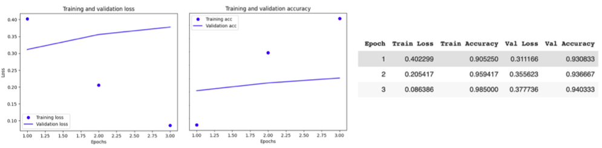
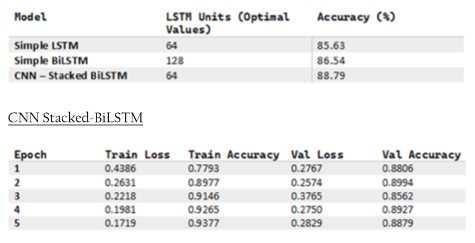

# LLM-vs-trad-model-sentiment-analysis
Comparison between an LLM (XLNet) and a traditional neural network (Ensemble of a CNN &amp; a Stacked BiLSTM) for sentiment prediction.

## Findings(XLNet)

## Findings(CNN/Stacked BiLSTM)

